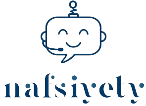

# Nafsiyeti Chatbot

In Arabic's embrace, where mental health whispers, `Nafsiyety`  blooms.This chatbot bridges stigma, empowers, guiding souls to wellness through information, support and culturally-aware care.Hope blossoms one conversation at a time.


<div align="center">
  
</div>


## Authors

- [@Ahmed Selmi](https://github.com/ahmed0219)
- [@Iyed Touati](https://github.com/luckyman147)
- [@Ghofrane Bouallegue](https://github.com/luckyman147)
- [@Mêd Wâlâ Čhêbìl](https://github.com/yuno2l)


## Installation

Install  Streamlit  with pip 

```bash
  pip install streamlit
```

## Run the code


```bash
cd code 
streamlit run user_interface.py
```
## Support

For support, email ahmedselmi939@gmail.com


## Feedback

If you have any feedback, please reach out to us at ahmedselmi939@gmail.com

